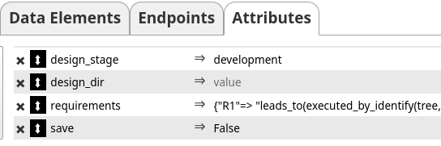

# PTV - Process Tree Verifier

QuickStart for Reviewers:

1. Download Repository (button is top right)
2. Unzip Repository `unzip Compliance-EF17.zip` (or however you usually unzip files)
3. Navigate to code `cd python_code`
4. Linux/Mac: `python3 test_script.py ../RunningExample/Running_Example.xml`
5. Windows: `python3 test_script.py ..\RunningExample\Running_Example.xml`
6. If any packages are missing (there should not be any) try `pip install -r requirements.txt`

This is the Github of the Process Tree Verification tool developed for the *Removed for Review* Paper as part of the *removed for Review* Project. The Process Tree Verifier is a Subscribtion based Rest Service that can be used to verify regulatory requirements on processes represented as process trees in the [cpee](https://www.cpee.org)-tree format.

This readme contains instructions on how to use the developed tool (A) with an existing process to see the functionality directly, (B) with new processes/requirements to show how it affects process modeling, (C) with a small testing script locally, and (D) with a locally deployed copy of the PTV for future development.

The prompts used for generating ASTs out of Natural Language / Textual Process Descriptions are in the ExtractionPrototype Directory.

The dataset used for evaluation is in the CompositeDataset directory. The processes are given as XML files that already contain the requirement ASTs so they can be loaded into the CPEE and verified as described in (B). The processes can also be found loaded into the [CPEE](https://cpee.org/hub/?stage=development&dir=Staff.dir/Loebbi.dir/Compliance.dir/CompositeDataSet.dir/)

The complete Documentation of the PTV can be found in a [Google Doc](https://docs.google.com/document/d/1zmmlLmjx7WXjEr13STYjuhUX3BA8nUhPKcK7uclMJtI/edit?usp=sharing).
In case this link breaks for any reason it is also in documentation.txt.

## (A) Testing with existing Processes

Testing with existing Processes can be done using the processes of the dataset in the [CPEE](https://cpee.org/hub/?stage=development&dir=Staff.dir/Loebbi.dir/Compliance.dir/CompositeDataSet.dir/).
A resulting compliance log which is changed whenever any of these processes is edited or a requirement is added can be found on [our server](https://power.bpm.cit.tum.de/output/Compliance/ComplianceLog.log).
Please be aware, that while concurrent process editing should not break anything, the resulting compliance log will be overwritten every time, to not eat up storage space. Accordingly, whenever you reload the page the compliance log might change in case another user(reviewer) is actively editing a process which is currently subscribed to the compliance subscriber (part of the dataset linked above).

## (B) Adding the subscription to a new Process

If you want to try out the verification yourself, you can also create a new model by pressing new model [here](https://cpee.org/hub/?stage=draft&dir=Testing.dir/) and connect it to the compliance subscriber. For this, follow the following steps:

Use the CPEE functionality "save test set" to download the XML test set.

Add the Compliance Subscriber to the test-set by copy-pasting the following into the XML. (You can also check the xml files of the composite dataset for examples with the subscriber added.

<subscriptions>
<subscription id="_compliance" url="https://power.bpm.cit.tum.de/compliance/Subscriber">
<topic id="description">
<event>change</event>
</topic>
</subscription>
</subscriptions>

Now, use the "load testset" button (seen above) to load the edited XML into the process. Save the model for safety.
To actually verify anything you have to still add compliance requirements. 
The compliance requirements are sent to the subscriber via the Attributes fields.
Accordingly, add any requirements encoded as an AST you want into it like so:

If you think you might have made syntax errors in encoding the requirements, we recommend using (C) to try out your process locally, such that the compiler will return error checking of your encoded requirements. In a future update this feature will be available as a separate service so syntax errors of requirements can be checked without having to add them to a subscribed process.
For a complete overview of all verification methods, you can check the source code in the python\_code dictionary or the regularly updated Documentation. 

Now, any change in the process will send a message to the subscriber. The resulting compliance log can still be found [here](https://power.bpm.cit.tum.de/output/Compliance/ComplianceLog.log), with the same concurrency problem as explained above.   

## (C) Local Testing Scripts
Complete local deployment requires setting up a server / configuring a firewall. In order to simplify local testing for users who do not want to spend that time but do want to test the PTV locally, we prepared a simple script interface for the PTV. To use the testing script, you first have to clone the repository and install dependencies. Instructions were tested on a fresh Fedora 43 installation but should work on other distributions and Windows/Mac as well.

1. Clone the Repository `git pull xxx`
2. Navigate to the python\_code dictionary `cd python_code`
3. (This was optional on Fedora): Install all dependencies `pip install -r requirements.txt`
4. On Linux: Launch the testing script `python3 test_script.py ../RunningExample/Running_Example.xml`
5. On Windows: Launch the testing script `python3 test_script.py ..\RunningExample\Running_Example.xml`

The above example tests the running example process also used throughout the paper, but you can also verify any other process xml found in the Composite Dataset, the two survey processes as well as any processes created in the process hub (as long as you add requirements to them)

## (D) Custom Deployment
Finally, you can also deploy the PTV locally, which we recommend in case you want to add additional functionality or simply run different tests.
The CPEE side would be handled the same as before, with the only change being that the URL needs to point toward your own endpoint. We recommend using a server such as nginx to forward the port (default is port 9321, which can be changed in python\_code/compliancesub.py) towards a URL. These instructions were tested on a fresh Fedora 43 Installation but should work on different systems as well. Depending on your distribution or Windows/Mac, you might have to install additional packages such as python3 and pip (any current version should do; all required packages are standard libraries).

To actually launch the project follow these steps:

1. Clone the Repository `git pull xxx`
2. Navigate to the python\_version dictionary `cd python_version`
3. Install all dependencies `pip install -r requirements.txt`
4. Launch the Application using `python3 compliancesub.py` (launches as a daemon, short explanation below)
5. Either use the endpoint at local host (127.0.0.1:9321) or set up port forwarding by setting up your firewall and webserver (we recommend using nginx and also setting up let's encrypt)
6. End the Daemon after using by executing `python3 compliancesub.py` again

compliancessub.py also contains a little script (def run\_server():) to ensure that the subscriber is started as a daemon. We are unsure how this will work on Windows/Mac so if you encounter any issues on these systems you can remove that codepiece and use the "normal" way to run fastapi rest services using `uvicorn.run compliancesub:app port=9321`. If you still encounter any issues on these systems you can contact us or just try out the example scripts presented in Section (C)

   

